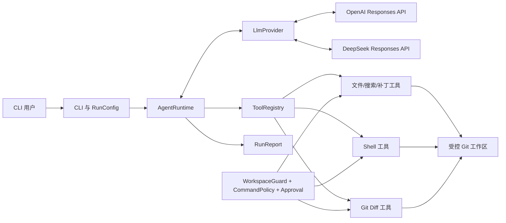
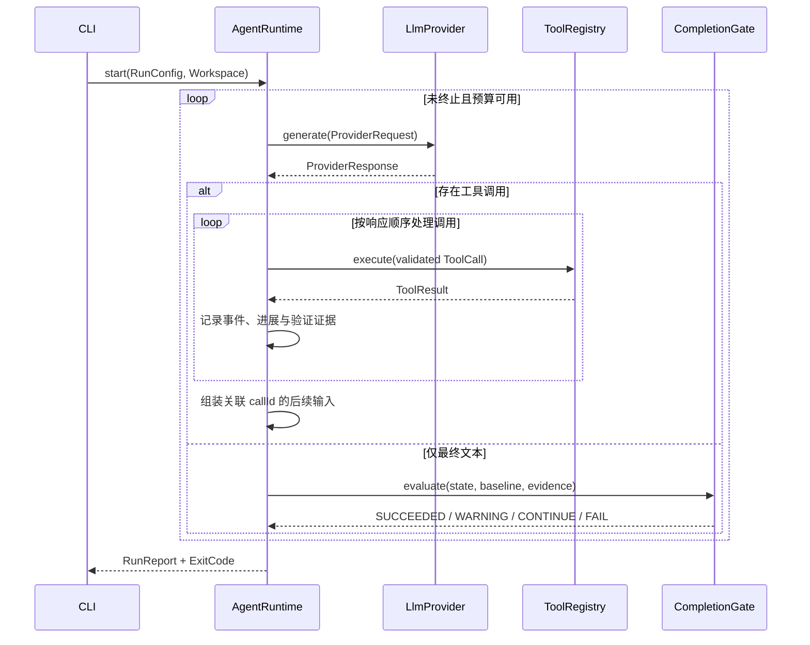

# Mini Coder V0.1 技术设计

## 1. 设计依据

本文仅基于 `requirements.md` 当前版本设计。其核心判断是：V0.1 要优先验证 Harness，而不是堆叠多 Agent、RAG 或平台功能；但只要允许执行 Shell 和修改文件，工作区边界、策略、审批和验证就必须与 Agent Loop 同期存在，而不能完全后置。

OpenAI Provider 采用 Responses API，是因为官方文档当前将其作为推理、工具调用和多轮工作流的推荐接口。DeepSeek 官方 API 现已原生支持 Responses API，但它是无状态接口且不支持 `previous_response_id`，因此使用同一领域契约、独立 Adapter 和私有有界回放 cursor。两个 Provider 的具体模型都由运行时配置，避免把易变化的模型别名固化为领域设计。（`REQ-003`、`REQ-016`、`REQ-020`）

## 2. 设计目标与非目标

### 2.1 设计目标

- `DG-001`：用最小但完整的闭环展示 Provider → Tool Call → Tool Result → Provider → Completion。（`REQ-003`、`REQ-004`）
- `DG-002`：把 Provider、工具、工作区、安全策略和报告从循环控制中解耦。（`REQ-005`、`REQ-016`）
- `DG-003`：成功状态由可验证证据决定，而不是由模型自报决定。（`REQ-009`、`REQ-011`、`REQ-012`）
- `DG-004`：所有副作用都经过统一边界和策略入口。（`REQ-002`、`REQ-007`、`REQ-008`、`REQ-010`、`REQ-013`）
- `DG-005`：核心行为可用 Fake Provider 与临时 Git 仓库离线复现。（`REQ-014`、`REQ-015`）
- `DG-006`：DeepSeek 密钥、线协议和无状态续接封装在 Adapter/Config 边界内，不改变 AgentRuntime、ToolRegistry 或 CompletionGate。（`REQ-016`、`REQ-020`）

### 2.2 非目标

- 不实现通用工作流引擎、多 Agent 编排、长期记忆或自动上下文压缩。
- 不把“命令黑名单”包装成强安全沙箱；V0.1 不面向不可信代码执行。
- 不自动提交、推送、发布、访问云资源或安装系统依赖。
- 不为多个 Provider 的差异寻找最低公分母；领域接口保留 Provider 不透明续接状态。

## 3. 系统上下文与架构

### 3.1 上下文

输入端是本地终端用户；外部依赖包括目标 Git 工作区、Java/Git/ripgrep/目标构建工具，以及可选的 OpenAI API 或 DeepSeek API。输出端是终端、JSON 报告、结构化日志和工作区内由补丁造成的变更。



### 3.2 建议源码结构

```text
src/main/java/<base-package>/
├── cli/           MainCommand, CliOptions
├── config/        RunConfig, ConfigLoader, SecretValue
├── agent/         AgentRuntime, RunStateMachine, CompletionGate
├── llm/           LlmProvider, ProviderRequest/Response, openai/*, deepseek/*
├── tool/          Tool, ToolDefinition, ToolRegistry, ToolResult
│   ├── file/      ListFilesTool, ReadFileTool, SearchCodeTool
│   ├── patch/     ApplyPatchTool
│   ├── shell/     ShellTool, ProcessRunner
│   └── git/       GitDiffTool, GitBaseline
├── workspace/     Workspace, WorkspaceGuard, PathResolver
├── security/      CommandPolicy, RiskClassifier, ApprovalService, Redactor
├── report/        RunReport, ConsoleReporter, JsonReporter
└── observability/ RunEvent, EventSink
```

测试结构镜像主代码，并增加 `fixture/`、`fake/ScriptedLlmProvider` 和临时 Git 仓库构造器。

## 4. 模块职责

| 模块 | 主要职责 | 明确不负责 | 需求 |
|---|---|---|---|
| CLI/Config | 参数解析、Provider 专用配置优先级、依赖预检、退出码 | Agent 决策、跨 Provider 密钥回退 | `REQ-001`、`REQ-012`、`REQ-020` |
| Workspace | 根目录规范化、Git 基线、路径边界 | 命令语义分类 | `REQ-002`、`REQ-009` |
| AgentRuntime | 循环编排、预算、状态转换、结果回传 | Provider 线协议、工具实现 | `REQ-003`、`REQ-004`、`REQ-011` |
| LlmProvider | 领域请求/响应与供应商 API 互换；封装有状态/无状态续接差异 | 工具执行、完成判定 | `REQ-003`、`REQ-016`、`REQ-020` |
| ToolRegistry | 工具发现、Schema 校验、执行分派 | 权限绕过、循环策略 | `REQ-005` |
| File/Patch Tools | 受控读取、搜索和原子补丁 | 工作区外访问、任意覆写 | `REQ-006`、`REQ-007` |
| Shell/ProcessRunner | 进程启动、捕获、超时、清理 | 自行决定审批 | `REQ-008` |
| Security | 命令分类、审批、路径策略、脱敏 | 宣称 OS 隔离 | `REQ-010`、`REQ-013` |
| CompletionGate | 根据 diff 与验证证据校准最终状态 | 接受模型自报为证据 | `REQ-011` |
| Report/Events | 结构化日志、终端/JSON 报告 | 记录完整秘密或文件正文 | `REQ-012`、`REQ-014` |

## 5. 控制流与数据流

### 5.1 启动阶段

1. CLI 解析参数，按“命令行非秘密配置 > Provider 专用环境变量 > 默认值”的优先级构建 `RunConfig`；密钥只从所选 Provider 的专用环境变量读取，禁止跨 Provider 回退。（`REQ-001`、`REQ-020`）
2. `Workspace.open()` 解析真实路径，验证目录和 Git 仓库，捕获 `GitBaseline`。（`REQ-002`）
3. 预检 Java 内置要求以外的 `git`、`rg` 以及 Provider 配置；`openai` 要求 `OPENAI_API_KEY`，`deepseek` 要求 `DEEPSEEK_API_KEY`，失败时不创建 Provider 请求或调用 LLM。（`REQ-001`、`REQ-006`、`REQ-020`）
4. 注册六个工具，生成不可变工具定义快照，创建 `RunContext` 与 `runId`。（`REQ-005`）

### 5.2 Agent Loop



关键规则：

- 多个工具调用在 V0.1 中按 Provider 返回顺序串行执行，保证结果确定性与审批清晰度。（`REQ-004`）
- 每个工具调用先经 Schema 校验，再经工具自身的路径/命令策略，任何失败都产生 ToolResult 返回模型，除非错误使运行不可继续。（`REQ-005`）
- 每次成功补丁使 `workspaceRevision` 加一，并使旧验证证据失效。（`REQ-007`、`REQ-011`）
- “进展”定义为：新的有效文件观察、新的搜索结果、工作区 revision 变化、不同的命令结果或从失败转为成功的验证结果。连续等价调用无新信息达到阈值时停止。（`REQ-004`）
- Provider 最终文本只触发完成检查；不能越过 `CompletionGate`。（`REQ-011`）

### 5.3 OpenAI Provider 续接

OpenAI Adapter 负责把 `ProviderRequest` 映射为 Responses API 请求，把 function tool calls 映射为领域 `ToolCall`，并在下一轮使用 Provider 返回的续接标识/响应项及 `call_id` 关联工具输出。AgentRuntime 不解析 OpenAI JSON。（`REQ-003`、`REQ-016`）

V0.1 使用直接工具调用；不启用 Programmatic Tool Calling、多 Agent 或 Hosted Shell，因为本项目的目的正是让本地 Harness 观察并控制每一步。（`REQ-003`、范围外约束）

### 5.4 DeepSeek Provider、配置与无状态续接

CLI 增加 `deepseek` Provider 值。配置矩阵如下，密钥无 CLI 参数且不得跨行回退：（`REQ-001`、`REQ-013`、`REQ-020`）

| 配置 | 命令行优先 | 环境变量 | 默认值 |
|---|---|---|---|
| Provider | `--provider deepseek` | 无 | `openai` |
| API key | 不支持明文参数 | `DEEPSEEK_API_KEY` | 无，缺失即 `CONFIG_ERROR` |
| Model | `--model` | `DEEPSEEK_MODEL` | 无，避免硬编码易变化别名 |
| Base URL | `--base-url` | `DEEPSEEK_BASE_URL` | `https://api.deepseek.com` |

`DeepSeekResponsesProvider` 使用 Java `HttpClient` 和 Jackson。它先以 URI 语义去除 Base URL 的尾部空路径段，再追加一个 `responses` 路径段：官方默认值解析为 `https://api.deepseek.com/responses`；自定义 Base URL 的既有路径原样保留，例如 `https://gateway.example/v1` 解析为 `https://gateway.example/v1/responses`。DeepSeek Adapter 不套用 OpenAI Adapter 自动注入 `/v1` 的规则，也不接受已包含 `/responses` 的 endpoint 冒充 Base URL。Bearer Auth 只在请求边界组装。它不得复用带有 OpenAI 名称、错误文案或配置语义的具体 Adapter；允许提取不对领域包公开的 Responses wire helper，但供应商错误分类和兼容差异仍由各 Adapter 持有。（`REQ-016`、`REQ-020`）

DeepSeek 官方 Responses API 不支持 `previous_response_id`。第一次请求发送 task、instructions 与工具定义；后续请求从 `ProviderCursor.opaque` 读取 Adapter 私有、大小/项数有界的回放状态，按顺序发送必要的既有 `message`、`reasoning`、`function_call` output items 与新的 `function_call_output`。Adapter 从响应中保存下一轮所需的受支持 items，但不把 reasoning 正文写入日志或报告。超过回放上限、出现未知必要 item 或无法解析 arguments 时返回非重试 `PROTOCOL`，不静默丢失上下文。（`REQ-003`、`REQ-013`、`REQ-014`、`REQ-020`）

DeepSeek 响应中的 function calls 仍映射为领域 `ToolCall`；多个调用按响应顺序交给现有 AgentRuntime 串行执行。DeepSeek API 即使并行生成工具调用，也不改变 V0.1 串行执行规则。响应 ID 用于报告关联而非服务端续接。（`REQ-004`、`REQ-020`）

## 6. 核心接口与数据契约

以下为设计级 Java 形状，不是最终实现代码。

```java
interface LlmProvider {
    ProviderResponse generate(ProviderRequest request, CancellationToken token)
        throws ProviderException;
}

record ProviderRequest(
    String systemInstructions,
    String userTask,
    List<ToolDefinition> tools,
    List<ToolExchange> newToolResults,
    ProviderCursor cursor,
    ProviderBudget budget
) {}

record ProviderResponse(
    String responseId,
    Optional<String> finalText,
    List<ToolCall> toolCalls,
    ProviderCursor nextCursor,
    Usage usage
) {}
```

`ProviderCursor` 是不透明值，可承载 OpenAI `previous_response_id`、DeepSeek 的有界回放状态或其他 Provider 续接数据，不允许 AgentRuntime 依赖其内部结构。Adapter 必须限制 cursor 序列化后的字节数、item 数和轮数，禁止无界累积。（`REQ-003`、`REQ-016`、`REQ-020`）

```java
interface Tool<I> {
    ToolDefinition definition();
    ToolResult execute(I input, ToolExecutionContext context);
}

record ToolCall(String callId, String name, JsonNode arguments) {}

record ToolResult(
    ToolStatus status,
    String summary,
    JsonNode data,
    boolean truncated,
    Optional<ToolError> error,
    Duration duration
) {}
```

`ToolStatus` 至少包含：`OK`、`INVALID_INPUT`、`NOT_FOUND`、`NO_MATCH`、`POLICY_DENIED`、`APPROVAL_REQUIRED`、`APPROVAL_DENIED`、`TIMEOUT`、`CONFLICT`、`FAILED`。（`REQ-005`）

```java
record RunConfig(
    Path workspace,
    String task,
    String provider,
    String model,
    int maxIterations,
    Duration maxDuration,
    Optional<CommandSpec> verifyCommand,
    boolean interactive,
    Optional<Path> jsonReport
) {}

record RunContext(
    UUID runId,
    Workspace workspace,
    GitBaseline baseline,
    int iteration,
    long workspaceRevision,
    List<VerificationEvidence> evidence,
    RunStatus status
) {}
```

### 6.1 工具输入摘要

| 工具 | 关键输入 | 关键限制 | 关键输出 |
|---|---|---|---|
| `list_files` | `path`, `maxDepth`, `limit` | 根内、稳定排序、默认忽略生成目录 | 相对路径、类型、截断 |
| `read_file` | `path`, `startLine`, `endLine` | 根内、文本、行/字节上限 | 带行号文本、编码、截断 |
| `search_code` | `query`, `path`, `glob`, `limit` | 使用参数数组启动 `rg` | 匹配文件/行/片段 |
| `apply_patch` | `patch` | unified diff、相对路径、事务预检 | revision、文件、统计 |
| `shell` | `executable`, `args[]`, `timeout`, `shellMode` | 策略、审批、根目录、输出上限 | exitCode、stdout/stderr、耗时 |
| `git_diff` | `scope`, `maxBytes` | 只读 Git 子命令 | status、diff、统计、归属 |

## 7. 工作区、补丁与 Git 基线设计

### 7.1 路径解析

`PathResolver.resolveInsideRoot(relativePath, accessMode)` 执行：拒绝空值/绝对路径 → 归一化 → 对已存在父链解析真实路径 → 检查以工作区真实根开头 → 对创建目标再次验证最近存在父目录。Windows 上比较路径时使用文件系统语义，不用字符串前缀。（`REQ-002`、`REQ-013`）

### 7.2 基线

启动时捕获：HEAD（若存在）、`git status --porcelain=v2 -z`、工作树 diff、暂存区 diff、未跟踪文件清单及相关内容摘要。最终 `GitChangeAttribution` 至少区分：`PREEXISTING`、`AGENT_CREATED`、`AGENT_MODIFIED`、`OVERLAPS_PREEXISTING_CHANGE`、`UNKNOWN`。（`REQ-009`）

不使用 reset、clean 或临时 commit。若需要精确比较，只在内存/临时安全区域保存基线快照/哈希；失败也不得覆盖用户文件。（`REQ-002`、`REQ-009`）

### 7.3 原子补丁

`apply_patch` 分两阶段：

1. 解析 diff、验证所有路径和上下文，并在内存生成所有目标文件的新内容。
2. 在同一文件系统的工作区内部写临时文件，再以可替换方式提交；提交前保存仅限本次目标的恢复材料。若任一提交失败，回滚已提交目标并报告失败。

任何回滚失败都升级为不可继续的 `WORKSPACE_INCONSISTENT`，报告确切文件，停止 Agent Loop。该设计提供可控失败下的事务语义，不承诺断电、进程崩溃或恶意文件系统情况下的跨文件原子性。（`REQ-007`）

## 8. Shell、安全与审批

### 8.1 进程执行

默认使用 `ProcessBuilder(List<String>)` 直接执行，工作目录固定为工作区根。`shellMode=none` 时拒绝管道、重定向、命令替换等 Shell 语法；只有用户/策略显式允许的 `powershell`、`cmd` 或 `bash` 模式才调用对应解释器。（`REQ-008`）

stdout/stderr 独立异步消费，保存前 N 字节与后 M 字节并记录原始计数。超时或取消时先温和终止，再终止整个后代进程树；最终报告清理结果。（`REQ-008`、`REQ-014`）

### 8.2 风险分类

策略采用“结构化规则 + 默认保守”而不是仅靠文本黑名单：

- `ALLOW`：明确的本地只读与验证命令，例如 `git status`、`git diff`、项目测试/构建命令。
- `REQUIRE_APPROVAL`：网络访问、远端写入、包发布、容器生命周期改变、安装依赖或作用域不明确的命令。
- `DENY`：递归删除仓库/广泛目录、覆写 Git 历史、工作区外路径、访问已知凭据目录、提权或规避策略。

分类器无法可靠解析时返回 `REQUIRE_APPROVAL`；非交互模式等价为拒绝。审批展示经过脱敏的可执行文件、参数、原因和预期副作用。（`REQ-010`、`REQ-013`）

### 8.3 安全边界声明

V0.1 的路径和命令策略只能降低误操作风险，不能阻止目标项目的构建脚本或子进程执行恶意行为。帮助和 README 必须要求仅对受信任或隔离副本运行；OS/容器沙箱是后续版本的独立能力。（`REQ-013`）

## 9. 完成判定与状态机

### 9.1 运行状态

```text
INITIALIZING → RUNNING → WAITING_APPROVAL → RUNNING
                       ↘ VERIFYING → RUNNING
RUNNING/VERIFYING → SUCCEEDED | SUCCEEDED_WITH_WARNINGS
RUNNING/* → CANCELLED | POLICY_BLOCKED | CONFIG_ERROR | PROVIDER_ERROR
          | TOOL_ERROR | LIMIT_REACHED | NO_PROGRESS | WORKSPACE_INCONSISTENT
```

### 9.2 完成门

`CompletionGate` 输入：Provider 最终文本、当前 `workspaceRevision`、最后修改 revision、验证证据、未处理错误、Git 变化和用户指定验证命令。

- 无文件变化：若任务确属无需修改，可 `SUCCEEDED_WITH_WARNINGS`；本 V0.1 默认编码任务不得无证据标记完整成功。
- 有文件变化：最后一次变更后必须存在相关且退出码为 0 的验证证据。
- 提供 `--verify-command`：其成功证据是 `SUCCEEDED` 的必要条件。
- 验证缺失但预算已尽：`SUCCEEDED_WITH_WARNINGS` 只表示 Agent 已产出变化，不等价于验收通过；CLI 使用不同退出码。
- 验证失败且有预算：把失败 ToolResult 返回 Provider；无预算则 `LIMIT_REACHED` 或 `TOOL_ERROR`。（`REQ-011`、`REQ-012`）

## 10. 错误、恢复与用户可见行为

| 错误类 | 示例 | 是否重试 | 处理 |
|---|---|---|---|
| 配置 | 缺模型、路径非 Git | 否 | 启动前失败，给修复建议 |
| Provider 瞬时 | 429、5xx、连接重置 | 有上限 | 指数退避 + jitter，尊重服务端提示 |
| Provider 永久 | 401、Schema 不兼容 | 否 | `PROVIDER_ERROR`，脱敏响应 |
| DeepSeek 余额 | 402 | 否 | `PROVIDER_ERROR`，明确余额不足但不包含密钥或原始敏感响应 |
| 工具输入 | 非法路径/Schema | 否 | 返回模型，计入无进展检测 |
| 策略 | 拒绝/未审批 | 否 | 返回模型；关键任务无法继续则停止 |
| 进程 | 非零退出 | 由 Agent 判断 | 作为观察结果，不自动视为系统故障 |
| 超时 | 命令/总运行超时 | 命令可由 Agent 换方案 | 清理进程树，报告证据 |
| 补丁冲突 | 上下文失配 | 可由 Agent 重读后重试 | 原子失败，不留部分变化 |
| 工作区不一致 | 补丁回滚失败 | 否 | 立即停止，列出受影响文件 |

重试预算独立计数，不得通过重试绕过总时限或最大迭代数。（`REQ-003`、`REQ-004`、`REQ-007`、`REQ-008`）

## 11. 日志、报告与脱敏

### 11.1 事件

`RunEvent` 包含时间、`runId`、迭代、事件类型、可选 `responseId/toolCallId`、耗时、状态和已脱敏元数据。事件类型包括 run started/stopped、provider started/completed/retried、tool validated/started/completed、approval requested/resolved、workspace changed、verification recorded、output truncated。（`REQ-014`）

### 11.2 报告

终端报告与 JSON 报告由同一 `RunReport` 渲染，避免事实漂移。报告包含：

- 状态、退出码、停止原因、`runId`；
- Provider/模型标识与聚合用量（若供应商提供）；
- 变更文件和归属；
- 验证命令、退出码、时间与 revision；
- 审批/策略摘要、截断与警告；
- 后续建议，但不夸大未验证结果。

`Redactor` 在日志、异常、工具输出和报告四个边界统一执行；至少对当前所选 Provider 的配置秘密精确替换，并对常见 Bearer/API key 模式做启发式遮蔽。OpenAI 与 DeepSeek 密钥不得同时注入不相关 Provider 的配置或错误上下文。（`REQ-012`、`REQ-013`、`REQ-020`）

## 12. 测试设计

### 12.1 单元测试

- RunStateMachine、CompletionGate、预算与无进展检测。
- JSON Schema 校验、ToolResult 序列化、Provider 接口合约。
- DeepSeek 配置优先级、密钥隔离、Base URL 规范化与错误分类。
- Windows 路径、`..`、符号链接/junction 边界。
- CommandPolicy 的 allow/approve/deny 表驱动样例。
- Redactor 对配置秘密和常见令牌格式的覆盖。

### 12.2 集成测试

- 临时 Git 仓库中的 list/read/search/diff。
- 补丁成功、上下文冲突、越界、多文件失败原子性。
- ProcessRunner 的 stdout/stderr、非零退出、超时、输出截断与进程树清理。
- ScriptedLlmProvider 驱动成功、失败修复、无进展、预算耗尽和审批拒绝场景。
- 模拟 DeepSeek Responses API 的最终文本、单/多工具调用、无状态多轮回放、用量、401/402/429/5xx/超时/超限/畸形响应与脱敏。

### 12.3 端到端验收

使用固定 Spring Boot fixture：预置一个有测试复现的空指针缺陷。Agent 需要定位问题、应用补丁、运行受控验证、最终报告 diff 和测试结果。离线主验收用 ScriptedLlmProvider；真实 OpenAI 与 DeepSeek smoke test 使用不同 profile，均单独标记且默认跳过，避免 CI 依赖秘密和公网。（`REQ-015`、`REQ-020`）

## 13. 性能、兼容性与运维考虑

- 文件/搜索/进程输出全程有界，避免单次结果耗尽上下文或内存。（`REQ-006`、`REQ-008`）
- V0.1 串行执行工具，以确定性换取吞吐；未来只有在无副作用且无决策依赖时才考虑并行。（`REQ-004`）
- 所有外部命令使用参数数组；Windows 的空格、Unicode、CRLF 和进程树行为纳入 CI/本机验收。（`REQ-016`）
- Provider、模型、Base URL、超时和重试配置化；不在领域层传播 OpenAI/DeepSeek SDK 或 JSON wire 类型。（`REQ-003`、`REQ-016`、`REQ-020`）

### 13.1 产品命名与兼容边界

对外展示、发行标识、Java 命名空间和文档路径采用以下唯一映射，当前树不保留废弃命名兼容层。（`REQ-017`–`REQ-019`）

| 类别 | 改名后标识 | 兼容策略 |
|---|---|---|
| 人类可读产品名 | `Mini Coder` | 当前文档不保留废弃品牌写法 |
| CLI usage name | `mini-coder` | 不保留废弃 usage name |
| Maven artifactId | `mini-coder` | 不生成废弃 artifactId 的兼容制品 |
| fat JAR / ZIP | `mini-coder-0.1.0-SNAPSHOT-all.jar` / `mini-coder-0.1.0-SNAPSHOT-dist.zip` | 清理构建后只产生新名制品 |
| ZIP 内可执行 JAR | `mini-coder.jar` | 不附带旧名副本 |
| Java package / Maven groupId | `dev.minicoder` | 主代码、测试、构建入口一次性迁移，不保留兼容 package |
| 规格目录 | `specs/mini-coder-v0.1/` | 迁移四份事实源并更新全部引用 |

CLI 单元测试断言 command name、版本文本和示例；打包验证断言制品名、ZIP 内容以及废弃制品不存在。受版本控制树扫描要求废弃产品名、目录 slug 和 package 变体零命中。（`AC-042`–`AC-045`）

### 13.2 文档目录迁移与证据保真

实施时先完成 Java 命名空间迁移，再移动四份规格到 `specs/mini-coder-v0.1/`，最后更新 `AGENTS.md`、`project_rule.md`、README、架构文档、变更记录、验证证据及四份规格中的全部路径引用。迁移完成后执行两类只读检查：一类验证废弃目录不存在且所有相对链接目标存在；另一类对全部受版本控制内容和路径执行废弃名称扫描，要求零例外。（`REQ-018`、`REQ-019`、`AC-046`、`AC-047`、`AC-051`）

验证证据中的改名前结果不替换成新制品名，也不继续复述废弃名称；当前文档用“改名前历史证据”加原日期、哈希和结果描述，原始文本由 Git 历史追溯。这样同时满足当前命名一致性和证据不可伪造。（`REQ-018`、`AC-048`）

### 13.3 Java 命名空间迁移

使用 Git 可识别的目录移动将 `src/main/java/dev/` 和 `src/test/java/dev/` 下的 package 根迁移为 `minicoder`，随后统一更新所有 Java `package`、`import`、完全限定类名、测试 fixture 文本、`pom.xml` 的 `groupId` 和 shade `mainClass`。不创建转发类、双 package 或旧坐标兼容模块，因为项目尚未发布稳定 Java API，兼容层只会永久保留名称歧义。（`REQ-019`、`AC-049`、`AC-050`）

迁移局部验证先执行编译和全部单元/集成测试；文档迁移完成后再执行最终 `clean verify`、两次离线 E2E、manifest/CLI 验收和受版本控制树零命中扫描。任何编译失败、测试数下降、旧路径残留或扫描命中都阻止完成状态。（`REQ-019`、`AC-051`、`AC-052`）

## 14. 迁移、发布与回滚

这是新建项目，无既有数据迁移。V0.1 发布物为可执行 JAR/分发包、README、安全边界和示例配置。产品、代码和文档改名通过一次 Java namespace 迁移、干净构建及文档目录迁移切换到 `mini-coder` 标识；废弃 package、制品和文档目录不作为兼容产物继续发布。DeepSeek 通过新增 Adapter、配置分支和测试 profile 发布，不改变现有 OpenAI/scripted 行为；回滚 DeepSeek 时整体移除其 CLI 值、配置、Adapter、profile 和文档，不把 DeepSeek 密钥回退给 OpenAI。（`REQ-017`–`REQ-020`）

实现回滚通过普通 Git 提交回退完成；运行期间不得自动 reset 用户工作区。若 Agent 产出的更改需要撤销，由用户审阅 diff 后使用其选择的版本控制流程处理，工具不代替用户执行破坏性恢复。（`REQ-009`、`REQ-013`）

## 15. 备选方案与权衡

### 15.1 直接使用 Agents SDK

- 优点：工具、追踪和 Agent 原语成熟，开发快。
- 缺点：隐藏本项目要学习的 Agent Loop 与 Provider/Tool 续接细节。
- 决策：V0.1 不采用；保留未来对比实现。（`REQ-003`、项目目标）

### 15.2 同时实现 OpenAI 与 DeepSeek

- 优点：立即验证多 Provider。
- 缺点：增加无状态续接、供应商配置隔离和第二套错误分类的实现/测试成本。
- 决策：用户已要求 DeepSeek 支持；使用独立 DeepSeek Responses Adapter 验证扩展边界，同时保留 AgentRuntime、ToolRegistry 和 CompletionGate 不变。（`REQ-015`、`REQ-016`、`REQ-020`）

### 15.3 只提供通用 Shell，不做专用文件工具

- 优点：实现少、能力广。
- 缺点：参数/输出难约束，审计和跨平台差，模型更容易执行高风险命令。
- 决策：保留受限 Shell，同时为高频操作提供六个明确工具。（`REQ-005` 至 `REQ-010`）

### 15.4 首版完全不做安全层

- 优点：开发最快。
- 缺点：一旦提供 Shell/补丁能力，误删、越界访问和外部副作用就成为真实风险。
- 决策：V0.1 必须做基础控制；强隔离后置且明确边界。（`REQ-010`、`REQ-013`）

### 15.5 使用 JGit 代替 Git CLI

- 优点：类型化 API、减少进程依赖。
- 缺点：学习/实现成本更高，行为与用户日常 Git 可能有差异。
- 决策：V0.1 使用受控只读 Git CLI；后续再评估 JGit。（`REQ-009`）

## 16. 未解决设计决定

- `DD-OPEN-001`：Maven 与 Gradle 的最终选择，当前按 `ASM-001` 采用 Maven。
- `DD-OPEN-002`：是否暴露 DeepSeek 专用 thinking/reasoning effort 参数；当前按 `OQ-001` 不暴露，使用供应商默认行为。
- `DD-OPEN-003`：审批交互的具体 UI 文案和超时时间，可在不改变风险分类语义的前提下实施时确定。
- `DD-OPEN-004`：跨平台 CI 是否首版同时覆盖 Windows 与 Linux；最低验收必须覆盖 Windows。

## 17. 需求到设计追踪

| 需求 | 主要设计章节 |
|---|---|
| `REQ-001` | 5.1、6、10 |
| `REQ-002` | 5.1、7.1、7.2 |
| `REQ-003` | 5.2、5.3、6、10 |
| `REQ-004` | 5.2、9、13 |
| `REQ-005` | 4、5.2、6、6.1 |
| `REQ-006` | 6.1、7.1、13 |
| `REQ-007` | 6.1、7.3、10 |
| `REQ-008` | 6.1、8.1、10 |
| `REQ-009` | 7.2、11.2、14 |
| `REQ-010` | 8.2、8.3 |
| `REQ-011` | 5.2、9.2、12 |
| `REQ-012` | 9、10、11.2 |
| `REQ-013` | 7、8、11、14 |
| `REQ-014` | 8.1、11.1、11.2 |
| `REQ-015` | 12 |
| `REQ-016` | 3.2、5.3、6、12、13 |
| `REQ-017` | 13.1、14 |
| `REQ-018` | 13.1、13.2、14 |
| `REQ-019` | 3.2、6、12、13.1、13.3、14 |
| `REQ-020` | 1、3–6、10–15 |

## 18. 参考资料

- OpenAI 官方 Model guidance：<https://developers.openai.com/api/docs/guides/latest-model>
- OpenAI 官方 Responses API 迁移/核心概念：<https://developers.openai.com/api/docs/guides/migrate-to-responses>
- DeepSeek 官方 Responses API 与兼容性说明：<https://api-docs.deepseek.com/guides/responses_api/>
- DeepSeek 官方认证与错误码：<https://api-docs.deepseek.com/api/deepseek-api/>、<https://api-docs.deepseek.com/quick_start/error_codes/>

外部文档只约束各自 Provider Adapter；领域接口和其余需求不依赖某个模型版本。
